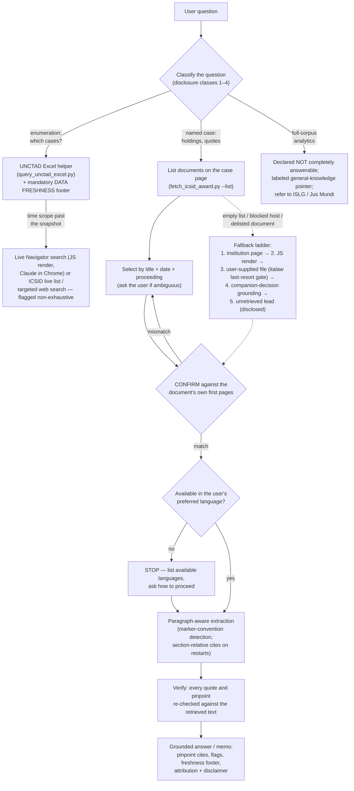

# 信息安全发展研究

原始名称：`isds-research`  
作者：Cameron Russell  
分类：litigation  
来源：https://lawve.ai/@cameron-russell/skill/isds-research  
来源类型：外部开源 Lawve skill

## README.md 中文翻译

# ISDS 研究技能

这是针对投资者与国家争端解决 (ISDS) 裁决的基于检索的研究援助。它通过从 ICSID、PCA 和其他官方来源检索**按需提供的主要文件**来回答有关投资争议案件和主题的问题，以在实际裁决文本中提供基本答案，并提供精确（段落/页）的引用。它遵守其所依赖的公共数据库的条款；它从不抓取或托管语料库，并且仅引用实际检索到的文本。

**不是法律建议。**

## 如何在克劳德中安装

1. **下载技能。** 在此处下载打包的 ZIP 文件：https://github.com/ccrnyc/isds-research/releases/latest/download/isds-research.zip （或者，从此存储库的 [发布页面](../../releases) 下载）。
2. **确保启用“云代码执行和文件创建”，以便技能可以运行**。在 Free/Pro/Max 计划中：转到“设置”>“功能”> 并确保“云代码执行和文件创建”已打开。在团队/企业计划中：您的组织所有者在组织设置 > 技能下启用技能。
3. **上传技能。** 进入自定义 > 技能，点击“+”或“添加”→“上传技能”，然后选择 ZIP。选择技能并将其打开。

要使用该技能，只需提出 ISDS 问题 - 例如*“Tecmed 诉墨西哥案中法庭如何阐明公平公正的待遇标准？”* 克劳德将自动调用该技能。

有关完整功能，请参阅下面的**网络要求**。

## 这里有什么

- `SKILL.md` — 代理技能：工作流程、合规护栏、归因/免责声明和黄金法则（基本，不要回忆）。
- `WRITEUP.md` — 设计说明：为什么以这种方式构建，如何评估（10 项裁决评估；版本 1.0 总体评级为 A−），以及 *Saluka*→*Macetex* 幻像引用发现。
- `scripts/fetch_icsid_award.py` — 列出 ICSID 案例页面上的文档，下载您选择的文档，显示其第一页，以便您可以确认它是正确的文档，然后提取段落感知文本（完整的 PDF，无截断），并带有可选的查询匹配。处理段落标记约定（`154.`和括号内的`[324]`，自动检测）和每个部分/章节编号重新启动（例如Macetx）：标题确认的重新启动产生章节相关引用（“第IV部分 - D章，第7段”）；无法识别的编号约定会触发明确的警告，要求退回到基于页面的引用。
- `scripts/query_unctad_excel.py` — 过滤本地 UNCTAD 完整数据 Excel 快照（`data/`）以查找“案例”问题：被告、条约、结果、违约、部门、规则、年份、仲裁员、自由文本的任意组合；提取 ICSID 案例编号（它们位于案例名称/链接文本内，而不是专用列）；标记快照数据假定已过时的行（“LIVE_CHECK”：在快照处待处理、后续待处理或最近活动）；并附加强制性数据新鲜度页脚（快照日期、贸发会议的非详尽警告，以及导航器“更新日期”日期的限制≤1×/天实时检查，离线时降级为“最后已知”）。
- `data/` — **您自己的 UNCTAD 官方完整数据 Excel 副本**存放在其中（2023 年 12 月 31 日发布的版本中有 1,332 个案例；实时导航器比它早运行约 2 年）。 **该文件不包含在本存储库中** — UNCTAD 的条款禁止重新分发；请参阅下面的下载部分。仅在本地用于非商业过滤，从未重新发布。

## 获取UNCTAD数据（必填，一次下载）

该技能的“哪些情况……”（枚举）功能在 UNCTAD 的官方全数据 Excel 上运行，**不包含在本存储库中**：UNCTAD 的[使用条款](https://investmentpolicy.unctad.org/pages/1048/terms-and-conditions-of-use) 允许个人、非商业使用，但禁止重新分发，因此每个用户都直接从 UNCTAD 下载自己的副本（免费，无注册）：

1.查看UNCTAD的[发布页面](https://investmentpolicy.unctad.org/publications/1303/investment-dispute-settlement-navigator-full-isds-data-release-as-of-31-12-2023-in-excel-format-)了解完整数据发布；截至撰写本文时，最新的是 **2023 年 12 月 31 日快照**：[直接下载](https://investmentpolicy.unctad.org/uploaded-files/document/UNCTAD-ISDS-Navigator-data-set-31December2023.xlsx)。
2. 将`.xlsx`放入该技能的`data/`文件夹中。在 Claude 聊天 (Cowork / claude.ai) 中，您只需**将文件上传到 Claude 并要求其将其保存到技能的“data/”文件夹中** — 然后 Claude 将在以后的会话中重复使用该文件，而无需重新上传。

如果您在没有文件的情况下运行技能，“query_unctad_excel.py”会打印这些相同的指令（“DATA_MISSING”），而不是神秘地失败。奖项检索（`fetch_icsid_award.py`）无需 Excel 即可运行；只有枚举需要它。

## 安装并运行
```
pip install requests pdfplumber openpyxl

# (first run) record your preferred language, asked once
python scripts/fetch_icsid_award.py --set-prefer-lang "English"

# 1) list every document on the case page (proceeding, title, date, languages)
python scripts/fetch_icsid_award.py --case "ARB(AF)/00/2" --list

# 2) select one, confirm it from its first page, and search it
python scripts/fetch_icsid_award.py --case "ARB(AF)/00/2" --select 1 --query "fair and equitable treatment"
```
第 2 步打印 CONFIRM 块（案例页标签、检测到的案例编号、首页文本），以便您可以在依赖文档之前对其进行验证，然后打印带有“para N (p.M)”引用的匹配段落，以及所需的 ICSID 归属和非法律建议免责声明。

**语言**被视为属性，而不是过滤器：奖项仅提供西班牙语/法语/等语言。是有效的结果。该工具会检索您的首选语言（如果存在）；如果没有，它不会默默地替换 - 它会列出文档*可用的语言，并询问您要如何继续（阅读现有的 ICSID 版本，或获取带有标记的、非权威的原文翻译），因为该页面并不总是确定哪种语言是权威的。使用 `--select N --lang "<语言>"` 提供选择。

## 网络要求

这些脚本直接获取文档和元数据，因此运行它们的环境需要对这些官方主机进行出站访问：

- `icsid.worldbank.org` — 案例详细信息页面
- `icsidfiles.worldbank.org` — 文档 PDF
- `investmentpolicy.unctad.org` — 您自己下载的 UNCTAD Excel，以及助手的新鲜度检查
- `pca-cpa.org` / `docs.pca-cpa.org` — PCA 案例页面和文档

**italaw 故意不在此列表中。** italaw 文档的默认路径是您在浏览器中手动下载它们（请参阅合规性说明） - 该工具不需要 italaw 网络访问权限，除非您明确批准门控、每个文档的回退。

**请将这些网站添加到您的允许列表中以使用该工具的完整功能。**

- **claude.ai / Cowork 团队或企业计划：** 网络访问由您的组织所有者控制。如果脚本报告被阻止的主机，请与所有者讨论是否可以将这些域添加到允许列表（或启用网络访问）。
- **Claude Code：** 在首次使用时批准每个域的网络提示，或在“settings.json”中预先允许“sandbox.network.allowedDomains”下的主机。

任何设置更改都是您自己进行的——该技能永远不会修改您的设置。这些域管理技能的*脚本*； Claude 的内置网络获取和 Chrome 中的可选 Claude 由您的 Claude 设置单独管理。

## 发现和数据新鲜度（优雅降级）

“哪些情况......”问题遵循**发现阶梯** - 每个梯级都会优雅地降级到下一个梯级，并且答案总是会揭示它所处的梯级：
1. **本地 UNCTAD Excel** (`scripts/query_unctad_excel.py`) — 截至快照日期（当前为 2023 年 12 月 31 日）的完整、可过滤的 UNCTAD 标记案例集。对于快照范围内的问题来说是主要且足够的。
2. **实时导航器搜索** — 用于快照后的新近度窗口。导航器的搜索/列表视图是 JS 渲染的，因此该梯级需要支持 JS 的浏览器渲染：**Chrome 中的 Claude 是可选的先决条件**（安装：https://code.claude.com/docs/en/chrome）。仅限有针对性的搜索；从不批量爬行。
3. **没有 Chrome** — 该技能*不会*失败或伪造完整性：它补充了 ICSID 自己的实时案例数据库（服务器渲染），用于 ICSID 子集和/或有针对性的网络搜索，明确标记为非详尽的指针而不是完整的集合。

命名案例查找永远不需要浏览器：各个 Navigator 案例页面由服务器呈现并通过数字 ID 进行解析 (`/investment-dispute-settlement/cases/{id}/{any-slug}`)。请注意新鲜度层：Excel 快照（2023 年 12 月 31 日）< 实时导航器（本身是一年两次的快照；当前为 2025 年 12 月 31 日）< 机构自己的实时页面 (ICSID/PCA) - 真正的当前状态仅来自最后一层。帮助程序的“LIVE_CHECK”标志标记快照数据假定已过时的行；它的新鲜度检查需要出站网络（在正常机器上工作/克劳德代码；一些沙箱会阻止它，在这种情况下它会报告“现在未验证”并继续）。

## 设计（RAG 管道）

1. **发现** — 上面的阶梯：本地 UNCTAD Excel → JS 渲染的导航器搜索（Claude 在 Chrome 中）→ ICSID 实时列表/公开限制的有针对性的网络搜索。 ICSID 自己的 ICSID 案例数据库（许可机器人）；从未批量收获。
2. **识别** — 获取 ICSID 案例详细信息页面并将*所有*已发布的文档解析为结构化表格（会议记录、标题、日期和每种可用语言 + URL），而不是抓取“第一个英文 PDF”。
3. **确认** — 下载所选文档并阅读其第一页，以验证标题、当事人、案件编号和日期是否与预期文档相符，然后再依赖该文档。
4. **提取** — pdfplumber，逐页检测段落编号，以便答案带有精确引用（完整 PDF，无截断）。
5. **地面** — 仅根据检索到的文本进行回答；如果没有一点，请说出来。
6. **验证** — 在发送之前确认检索到的文本中出现的每个引用/段落。

## 这个工具的优点和缺点是什么

**做得很好：**可验证的研究。单文档问题（“*Tecmed* 如何对待比例性？”）得到基于已确认的原始文本的精确引用的答案。有界比较（“比较主题 A 上的 X、Y、Z”）得到相同的结果，加上所需的完整性检查，以标记（作为明确未经检查的线索）对主题进行全面处理所需的任何其他案例或权限。类别枚举（“哪些条约案例源于委内瑞拉国有化？”）在贸发会议的官方数据集上运行，并披露了其范围和快照日期。

**故意不：**语料库分析。这里没有被删除的奖项语料库（有意设计——请参阅合规说明），也无法访问订阅数据库（投资者国家法律指南、Jus Mundi、italaw 全文）。因此，诸如“主题Z被引用最多的案例”或“仲裁员N多久提出异议”之类的问题无法得到完全回答；该工具是这样说的，提供了一个明确标记的一般知识指针，并将用户引向为该工作构建的数据库。该工具的设计诚实地说明了其局限性：每个答案都说明了实际检查的内容和未检查的内容。

## 合规说明

- **ICSID** 条款允许查看/下载用于个人、非商业用途；没有再分发或衍生数据库。需要归属（脚本发出）。
- **UNCTAD** 仅是发现/元数据；它的机器人会阻止批量/训练爬虫，并且它的条款栏会编译/重新分发其数据集——因此它是在人工指导下或通过有针对性的“Claude-User”获取来使用的，从不批量收获。
- **italaw** 是**最后的手段，仅限于每个案例确认的后备**：首先是官方来源（ICSID/PCA）；默认路径是用户手动下载文档（italaw的条款明确允许手动浏览）；自动获取仅在每个文档人工确认的情况下发生，作为克劳德用户，每个批准一个文档，参考-请勿复制并记录。 italaw 内容永远不会进入任何构建/测试语料库。有关完整条件，请参阅 SKILL.md 中的 italaw 条目。
- 礼貌访问：描述性用户代理、请求之间的礼貌延迟、仅限单文档点播。

## 许可证

版权所有 (C) 2026 卡梅伦·拉塞尔 (ccrnyc)。根据 **GNU Affero 通用公共许可证 v3.0**（仅限 AGPL-3.0）获得许可 — 请参阅 [许可证](许可证)。该程序不附带任何保证。许可证仅涵盖技能的代码和文档；检索到的文件和贸发会议数据集仍受其来源条款的约束（参见合规性说明）。

## 已知限制

- `web_fetch`（无代码回退）将很长的 PDF 截断为约 120k 个字符，这会默默地删除长奖励的后面段落 - 文档深处的内容会从视图中消失。该脚本通过下载文件并使用 pdfplumber 提取来避免这种情况 - 在主机 (`icsidfiles.worldbank.org`) 可访问的地方运行它。请注意，“icsidfiles.worldbank.org”在裸域请求上返回 403，但通常提供真实的 PDF 路径；一些沙箱会阻止网络代理上的主机，在这种情况下在本地或支持网络的环境中运行。
- ICSID 案例详细信息页面在每个案例中呈现不一致：大多数在初始 HTML 中携带文档链接（简单的“请求”可以看到它们），但有些在客户端注入列表。当文档列表返回为空时，技能不会猜测 - 它会诊断原因并回退到支持 JS 的渲染或请求文档 URL（请参阅 SKILL.md 中的检索回退阶梯）。

---

## SKILL.md 中文翻译

（SKILL.md 原文已完整抓取，中文翻译待补。）

---

## README.md Original

# ISDS Research skill

This is a retrieval-grounded research aid for investor-State dispute settlement (ISDS) awards. It answers questions on investment dispute cases and topics by retrieving **primary documents on demand** from ICSID, PCA, and other official sources to ground answers in the actual award text, with pinpoint (paragraph / page) citations. It complies with the terms of the public databases on which it relies; it never scrapes or hosts a corpus, and it cites only text it actually retrieved.

**Not legal advice.**

## How to install in Claude

1. **Download the skill.** Download the packaged ZIP file here: https://github.com/ccrnyc/isds-research/releases/latest/download/isds-research.zip (alternatively, download from this repo's [Releases page](../../releases)).
2. **Ensure "Cloud code execution and file creation" is enabled so skills can run**. On Free/Pro/Max plans: go to Settings > Capabilities > and make sure "Cloud code execution and file creation" is turned on. On Team/Enterprise plans: your organization Owner enables Skills under Organization settings > Skills.
3. **Upload the skill.** Go to Customize > Skills, click "+" or "Add"  → "Upload a skill", and select the ZIP. Select the skill and toggle it on.

To use the skill, just ask an ISDS question — e.g. *"How did the tribunal in Tecmed v. Mexico articulate the fair and equitable treatment standard?"* Claude will invoke the skill automatically.

For full functionality, see **Network requirements** below.

## What's here

- `SKILL.md` — the agent skill: workflow, compliance guardrails, attribution/disclaimer, and the golden rule (ground, don't recall).
- `WRITEUP.md` — design notes: why it's built this way, how it was evaluated (10-item adjudicated eval; version 1.0 graded overall A−), and the *Saluka*→*Methanex* phantom-citation finding.
- `scripts/fetch_icsid_award.py` — lists the documents on an ICSID case page, downloads the one you select, shows its first page(s) so you can confirm it is the right document, then extracts paragraph-aware text (full PDF, no truncation), with optional query matching. Handles both paragraph-marker conventions (`154. ` and bracketed `[324] `, auto-detected) and per-Part/Chapter numbering restarts (e.g. Methanex): heading-confirmed restarts yield section-relative cites ("PART IV - CHAPTER D, para 7"); unrecognized numbering conventions trigger an explicit warning to fall back to page-based cites.
- `scripts/query_unctad_excel.py` — filters the local UNCTAD full-data Excel snapshot (`data/`) for "which cases" questions: any combination of respondent, treaty, outcome, breach, sector, rules, year, arbitrator, free text; extracts ICSID case numbers (they live inside the case-name/link text, not a dedicated column); flags rows whose snapshot data is presumptively stale (`LIVE_CHECK`: pending at snapshot, follow-on pending, or recent activity); and appends a mandatory data-freshness footer (snapshot date, UNCTAD's non-exhaustive caveat, and a throttled ≤1×/day live check of the Navigator's "Updated as of" date, degrading to "last known" when offline).
- `data/` — where **your own copy** of UNCTAD's official full-data Excel lives (1,332 cases in the 31/12/2023 release; the live Navigator runs ~2 years ahead of it). **The file is not included in this repo** — UNCTAD's terms bar redistribution; see the download section below. Used locally for non-commercial filtering only, never republished.

## Get the UNCTAD data (required, one download)

The skill's "which cases…" (enumeration) features run on UNCTAD's official full-data Excel, which is **not included in this repo**: UNCTAD's [Terms of Use](https://investmentpolicy.unctad.org/pages/1048/terms-and-conditions-of-use) permit personal, non-commercial use but bar redistribution, so each user downloads their own copy directly from UNCTAD (free, no registration):

1. Check UNCTAD's [release page](https://investmentpolicy.unctad.org/publications/1303/investment-dispute-settlement-navigator-full-isds-data-release-as-of-31-12-2023-in-excel-format-) for the full-data release; as of this writing the latest is the **31/12/2023 snapshot**: [direct download](https://investmentpolicy.unctad.org/uploaded-files/document/UNCTAD-ISDS-Navigator-data-set-31December2023.xlsx).
2. Put the `.xlsx` in this skill's `data/` folder. In a Claude chat (Cowork / claude.ai), you can simply **upload the file to Claude and ask it to save it into the skill's `data/` folder** — Claude will then reuse it in later sessions without re-uploading.

If you run the skill without the file, `query_unctad_excel.py` prints these same instructions (`DATA_MISSING`) instead of failing cryptically. Award retrieval (`fetch_icsid_award.py`) works without the Excel; only enumeration needs it.

## Install & run

```
pip install requests pdfplumber openpyxl

# (first run) record your preferred language, asked once
python scripts/fetch_icsid_award.py --set-prefer-lang "English"

# 1) list every document on the case page (proceeding, title, date, languages)
python scripts/fetch_icsid_award.py --case "ARB(AF)/00/2" --list

# 2) select one, confirm it from its first page, and search it
python scripts/fetch_icsid_award.py --case "ARB(AF)/00/2" --select 1 --query "fair and equitable treatment"
```

Step 2 prints a CONFIRM block (case-page label, detected case number, first-page text) so you can verify the document before relying on it, then the matching passages with `para N (p.M)` citations, plus the required ICSID attribution and a not-legal-advice disclaimer.

**Language** is treated as an attribute, not a filter: awards available only in Spanish/French/etc. are valid results. The tool retrieves your preferred language when it exists; when it doesn't, it does not silently substitute — it lists the languages the document *is* available in and asks how you want to proceed (read an existing ICSID version, or get a flagged, non-authoritative translation of the original), because the page doesn't always establish which language is authoritative. Supply the choice with `--select N --lang "<language>"`.

## Network requirements

The scripts fetch documents and metadata directly, so the environment running them needs outbound access to these official hosts:

- `icsid.worldbank.org` — case-detail pages
- `icsidfiles.worldbank.org` — the document PDFs
- `investmentpolicy.unctad.org` — your own download of the UNCTAD Excel, and the helper's freshness check
- `pca-cpa.org` / `docs.pca-cpa.org` — PCA case pages and documents

**italaw is deliberately not on this list.** The default route for italaw documents is you downloading them manually in your browser (see Compliance notes) — the tool needs no italaw network access unless you explicitly approve the gated, per-document fallback.

**Please add these sites to your allow list to use the tool's full functionality.**

- **claude.ai / Cowork on Team or Enterprise plans:** network access is controlled by your organization Owner. If the scripts report blocked hosts, discuss with the Owner whether these domains can be added to the allow list (or network access enabled).
- **Claude Code:** approve the per-domain network prompts on first use, or pre-allow the hosts under `sandbox.network.allowedDomains` in your `settings.json`.

Any settings change is yours to make — the skill never modifies your settings. These domains govern the skill's *scripts*; Claude's built-in web fetch and the optional Claude in Chrome are governed separately by your Claude settings.

## Discovery & data freshness (graceful degradation)

"Which cases…" questions follow a **discovery ladder** — each rung degrades gracefully to the next, and the answer always discloses which rung it stands on:

1. **Local UNCTAD Excel** (`scripts/query_unctad_excel.py`) — the complete, filterable set of UNCTAD-tagged cases up to the snapshot date (currently 31/12/2023). Primary and sufficient for questions bounded by the snapshot.
2. **Live Navigator search** — for the recency window after the snapshot. The Navigator's search/list views are JS-rendered, so this rung requires a JS-capable browser render: **Claude in Chrome is an optional prerequisite** (install: https://code.claude.com/docs/en/chrome). Targeted searches only; never bulk-crawled.
3. **Without Chrome** — the skill does *not* fail or fake completeness: it supplements with ICSID's own live case database (server-rendered) for the ICSID subset and/or targeted web search, expressly flagged as non-exhaustive pointers rather than a complete set.

Named-case lookups never need a browser: individual Navigator case pages are server-rendered and resolve by numeric id (`/investment-dispute-settlement/cases/{id}/{any-slug}`). Note the freshness layers: Excel snapshot (31/12/2023) < live Navigator (itself a ~biannual snapshot; currently 31/12/2025) < the institutions' own live pages (ICSID/PCA) — truly current status comes only from the last layer. The helper's `LIVE_CHECK` flag marks rows whose snapshot data is presumptively stale; its freshness check requires outbound network (works on a normal machine / Claude Code; some sandboxes block it, in which case it reports "NOT verified now" and continues).

## Design (the RAG pipeline)


1. **Discovery** — the ladder above: local UNCTAD Excel → JS-rendered Navigator search (Claude in Chrome) → ICSID live list / targeted web search with disclosed limits. ICSID's own case database (permissive robots) for ICSID cases; never bulk-harvested.
2. **Identify** — fetch the ICSID case-detail page and parse *all* published documents into a structured table (proceeding, title, date, and every available language + URL), rather than grabbing "the first English PDF".
3. **Confirm** — download the selected document and read its first page(s) to verify title, parties, case number, and date match the intended document before relying on it.
4. **Extract** — pdfplumber, page-by-page, detecting paragraph numbers so answers carry pinpoint cites (full PDF, no truncation).
5. **Ground** — answer only from retrieved text; if a point isn't there, say so.
6. **Verify** — confirm every quote/paragraph appears in the retrieved text before sending.

## What this tool does well and does not do

**Does well:** verifiable research. Single-document questions ("how did *Tecmed* treat proportionality?") get pinpoint-cited answers grounded in the confirmed primary text. Bounded comparisons ("compare X, Y, Z on topic A") get the same, plus a required completeness check that flags — as expressly unexamined leads — any other cases or lines of authority a full treatment of the topic would need. Category enumeration ("which treaty cases arose from the Venezuelan nationalizations?") runs on UNCTAD's official dataset with its scope and snapshot date disclosed.

**Deliberately does not:** corpus analytics. There is no scraped award corpus here (by design — see Compliance notes) and no access to subscription databases (Investor-State LawGuide, Jus Mundi, italaw full-text). So questions like "the most-cited case on topic Z" or "how often does arbitrator N dissent" cannot be answered completely; the tool says so, offers a clearly-labeled general-knowledge pointer, and refers the user to the databases built for that job. The tool is designed to be honest about its limits: every answer states what was actually examined and what wasn't.

## Compliance notes

- **ICSID** Terms permit viewing/downloading for personal, non-commercial use; no redistribution or derivative database. Attribution required (the script emits it).
- **UNCTAD** is discovery/metadata only; its robots blocks bulk/training crawlers and its Terms bar compiling/redistributing its dataset — so it is used human-directed or via targeted `Claude-User` fetches, never bulk-harvested.
- **italaw** is a **last-resort, per-case-confirmed fallback only**: official sources (ICSID/PCA) first; the default route is the user downloading the document manually (italaw's Terms expressly permit manual browsing); an automated fetch happens only with per-document human confirmation, as Claude-User, one document per approval, reference-don't-reproduce, and logged. italaw content never enters any build/test corpus. See the italaw entry in SKILL.md for the full conditions.
- Polite access: descriptive User-Agent, courtesy delay between requests, single-document on-demand only.

## License

Copyright (C) 2026 Cameron Russell (ccrnyc). Licensed under the **GNU Affero General Public License v3.0** (`AGPL-3.0-only`) — see [LICENSE](LICENSE). This program comes with ABSOLUTELY NO WARRANTY. The license covers the skill's code and documentation only; retrieved documents and the UNCTAD dataset remain governed by their own sources' terms (see Compliance notes).

## Known constraints

- `web_fetch` (the no-code fallback) truncates very long PDFs at ~120k characters, which silently drops the later paragraphs of a long award — a holding deep in the document simply vanishes from view. The script avoids this by downloading the file and extracting with pdfplumber — run it where the host (`icsidfiles.worldbank.org`) is reachable. Note `icsidfiles.worldbank.org` returns 403 on a bare-domain request but serves real PDF paths normally; some sandboxes block the host at the network proxy, in which case run locally or in a network-capable environment.
- ICSID case-detail pages are inconsistently rendered per case: most carry the document links in the initial HTML (plain `requests` sees them), but some inject the list client-side. When the document list comes back empty, the skill does not guess — it diagnoses the cause and falls back to a JS-capable render or asks for the document URL (see the retrieval fallback ladder in SKILL.md).

---

## SKILL.md Original

---
name: isds-research
version: 1.0.0
maintainer: ccrnyc
license: AGPL-3.0-only
description: Compliant, retrieval-grounded research over investor-State dispute settlement (ISDS) awards and decisions. Use when the user asks about ICSID / investment-treaty arbitration cases, awards, or doctrines (fair and equitable treatment, expropriation, jurisdiction, costs, annulment, etc.) and wants answers grounded in the actual document text with pinpoint citations. Identifies the correct document on the case page, confirms it against the PDF's own first pages, retrieves primary documents on demand from ICSID, PCA, etc., never scrapes or hosts a corpus in violation of applicable terms, and cites only retrieved text.
---

# ISDS Research

Answer questions about ISDS cases by retrieving the **primary documents on demand** and grounding every legal statement in the retrieved text, with pinpoint (paragraph / page) citations. This is a research aid, **not legal advice**.

**Intended users:** lawyers, arbitration practitioners, academics, and students who need *verifiable* ISDS research — every output is research support for the user's own professional judgment: the tool retrieves, cites, and discloses; the user analyzes and concludes.

## Golden rules (read first)

1. **Ground, don't recall.** Every holding, quote, or pinpoint cite MUST come from text you retrieved *this session*. If it isn't in the retrieved text, say "not found in the retrieved document" — never fill the gap from memory. This is the anti-hallucination guarantee. **Framework law too:** a statement of treaty, Convention, or arbitration-rules law (e.g. "Art. 52(6) resubmission presupposes annulment", "improper constitution is the Art. 52(1)(a) ground") made without retrieving the provision's text must carry a basis label ("per general knowledge based on training data and/or websearch — provision text not retrieved this session"); where such a premise is load-bearing for the answer, prefer retrieving the provision (ICSID hosts the Convention and Rules on its own site) — article-number and ground mislabels are a known secondary-reporting failure.
2. **Confirm whether a decision is reciting a party's argument or the tribunal's view.** Decisions often spend significant space reciting the parties' positions before providing the tribunal's analysis. Before quoting or characterizing any passage: (a) **Voice** — verify whether it is the tribunal/committee's own finding or its recital of a party's argument, and attribute quotes, positions, and holdings accordingly (headings can help to identify whether a passage is attributable to a party or the tribunal, but are not definitive). (b) **How held** — when describing a holding, check whether it was unanimous or by majority: read the dispositif, check the case page for dissenting/separate opinions, and state which limbs were unanimous vs. by majority. If the retrieved text doesn't establish it, say so rather than assuming. Note: some user questions will require providing the parties' arguments, not just the tribunal's holdings.
3. **Identify before you download.** A case page can list dozens of documents (award, decisions on jurisdiction, rectification, annulment, dissents, procedural orders). Never assume "the first PDF" is the one you want. List the documents, choose by title + date + proceeding, then **confirm from the document's own first page(s)** before relying on it.
4. **Language is an attribute, not a filter.** Awards are frequently available only in Spanish/French/etc. A non-English award is a valid, relevant result — do not skip it because it isn't in English.
5. **On demand, single documents.** Fetch the specific document the user needs. Never bulk-download or mirror.
6. **Sources and their rules:**
   - **ICSID** (`icsid.worldbank.org` / `icsidfiles.worldbank.org`) — primary text. Permissive robots; Terms allow viewing/downloading for personal, non-commercial use. Do not redistribute; attribute (below).
   - **PCA** (`pca-cpa.org`; documents on `docs.pca-cpa.org`) — primary text for PCA-administered cases (many UNCITRAL investor-State arbitrations). Robots + Terms verified 2026-07-02: the main site's robots allows `Claude-User` (disallows only `/wp-admin/`); the document host returns S3 `AccessDenied` for robots.txt (no robots file → no crawl restriction; a 4xx robots response is treated as "allow"); PCA's Terms of Use bar only *commercial* use without permission and impose **no** automated-access restriction. Fetch specific documents on demand for non-commercial research; attribute; do not republish; honor any case-specific restriction (Terms cl.1 — many PCA/UNCITRAL matters are confidential or only partially published). No PCA helper script yet: locate the document on the PCA case page and fetch that URL, then extract as for ICSID.
   - **UNCTAD ISDS Navigator** — discovery / metadata only. You may run these searches yourself via targeted, user-initiated `Claude-User` fetches (UNCTAD's robots blocks only ClaudeBot, not Claude-User; its Terms permit personal, non-commercial use). Do **not** scrape or paginate the UI; link and attribute, never republish it. **Reliable path for complete category-filtering:** use UNCTAD's official *full-data Excel export* (structured; all filter fields) — that's the intended public data product, not scraping (local non-commercial filtering only; don't republish or build a public derivative DB). Individual Navigator *case pages* are server-rendered and load fine via `web_fetch` (good for targeted single-case metadata — which also carries the ICSID case number for grounding); it's the *filtered search/list* views that are JS-rendered and time out, so enumerate via the Excel export (or a browser render), not by scraping search pages. **Freshness:** the data is dated snapshots refreshed ~1–2×/year and, per UNCTAD, "cannot be deemed exhaustive" (publicly-known cases only; confidential ones excluded) — state the snapshot date and this caveat.
   - **italaw** (`italaw.com`) — **last-resort, per-case-confirmed primary-text fallback**. Reach italaw only after ICSID / PCA / other official sources are exhausted for the specific document. **Default route: the user obtains the document manually and supplies the file** (`--pdf-file`) — italaw's Terms §4.2 expressly permit manual human browsing. An automated fetch is the fallback only, and only under **all** of these conditions: (i) **per-document human confirmation** — show the case + exact italaw URL and obtain an affirmative approval each time; no "approve all", no persistent auto-yes; (ii) **Claude-User only** — never spoof a human-browser user-agent; (iii) **one document per approval** — never bulk, batch, loop, or deep-link lists; (iv) **reference, don't reproduce** — short pinpoint quotes + cite/link back to the italaw case page; no wholesale reproduction or AI summary substituting for the source; (v) **log each approval** (document, URL, timestamp) in the run log. Keep italaw content out of any build/test corpus (Terms §4.1); non-commercial use only (§§4.3/5.1); re-check robots.txt + Terms periodically (§8.1 lets italaw change them without notice). A single, per-document, human-confirmed fetch is not prohibited under §4.2 of italaw's terms as it does not constitute bulk access or circumvent any italaw access controls.
7. **UNCTAD is required for "which cases" questions — never fake completeness.** When a question needs a *complete set* of cases filtered by a UNCTAD category (issue/breach, treaty, sector, forum, outcome, amount), build it from UNCTAD's data via the local Excel helper: `python scripts/query_unctad_excel.py` (filters, ICSID-case-number extraction, and the mandatory data-freshness footer). Do **not** substitute ICSID, WebSearch, or memory to enumerate cases — ICSID doesn't tag issues, WebSearch isn't exhaustive, and memory hallucinates and is bound by a training cut-off, so each silently misses cases. If you can't reach UNCTAD data, say the set can't be completed and scope the answer; note results are current only to UNCTAD's last snapshot and are non-exhaustive per UNCTAD; indicate to users when answers may be impacted by known data gaps.
8. **Attribute and disclaim** every answer (templates below).

## First run: the UNCTAD Excel (walk the user through one download)

Enumeration ("which cases") questions need UNCTAD's full-data Excel in the skill's `data/` folder. If `scripts/query_unctad_excel.py` prints **`DATA_MISSING`** (or before the first enumeration question, if `data/` has no `.xlsx`), do NOT try to fetch the file yourself and do NOT answer from memory. Instead, tell the user — in your own words, covering all four points:

1. **What's needed:** UNCTAD publishes its full ISDS case dataset as a free Excel download; the skill filters it locally to answer "which cases" questions completely and verifiably.
2. **Why they must download it (not you, not the repo):** UNCTAD's Terms permit personal, non-commercial use but bar redistribution — so the skill doesn't ship the file, and each user obtains their own copy directly from UNCTAD under those terms.
3. **Where:** check the release page for the newest version first — https://investmentpolicy.unctad.org/publications/1303/investment-dispute-settlement-navigator-full-isds-data-release-as-of-31-12-2023-in-excel-format- — latest known direct link (31/12/2023 snapshot): https://investmentpolicy.unctad.org/uploaded-files/document/UNCTAD-ISDS-Navigator-data-set-31December2023.xlsx
4. **Then:** ask them to **upload the downloaded file into the chat so you can save it to the skill's `data/` folder** — that way it persists and is reused in every later session without re-uploading. (Users running locally can just place the file in `data/` themselves.) When you receive the upload, save it to `data/` and confirm.

Award retrieval works without the Excel; only enumeration needs it.

## First run: set the language preference (ask once)

Before the first retrieval, check whether a preferred language is on record:

```
python scripts/fetch_icsid_award.py --show-config
```

If it prints `NO_CONFIG`, **ask the user their preferred language** and tell them the policy you will follow:

> I'll (i) default to providing decisions in your preferred language; (ii) indicate when the original version is in a different language; and (iii) if a decision is not available in your preferred language, tell you which languages it *is* available in on the ICSID website and ask how you'd like to proceed — read one of those versions (e.g. an existing ICSID translation), or have me translate the original myself, flagged as my own, non-authoritative translation.

Then record it (this is stored, so you only ask once):

```
python scripts/fetch_icsid_award.py --set-prefer-lang "English"
```

## Workflow

1. **Identify the case (or discover cases).** Get the ICSID case number (e.g. `ARB(AF)/00/2`) or name. For cross-institution or "which cases" discovery, follow the **discovery ladder** (degrade gracefully, disclose at each step):
   1. **Excel helper first** — `python scripts/query_unctad_excel.py …` gives the complete UNCTAD-tagged set up to the snapshot date (see Source routing below).
   2. **Recency window (after the snapshot):** the Navigator's *search/list* views are JS-rendered — `web_fetch` times out on them — so live filtered discovery needs a JS-capable render (**Claude in Chrome**, optional prerequisite), keeping to the specific searches the request needs; never bulk-crawl.
   3. **No Chrome available?** Supplement with ICSID's own live case database for the ICSID subset (server-rendered), and/or targeted `WebSearch` — but present these as *non-exhaustive pointers*, never as the complete set (golden rule 7).
   4. Whatever the path, state what the coverage is and what may be missed. Individual Navigator *case pages* (named-case lookups) never need Chrome — they are server-rendered and fetchable by numeric id.

   Then hand each ICSID case off to the retrieval steps below for grounded text. For non-ICSID cases: **PCA**-administered, published matters are groundable too (fetch the specific document — see Sources); other forums (e.g. SCC) yield metadata + the official link only.

2. **List the documents** on the case page:
   ```
   python scripts/fetch_icsid_award.py --case "ARB(AF)/00/2" --list
   ```
   This prints every published document — proceeding, title, date, and one row per available language + URL — plus a machine-readable `JSON_DOCS=` line.

3. **Choose the target document** by title + date + proceeding (e.g. "Award of the Tribunal (May 29, 2003)", not the "Introductory Note"; the right proceeding if there was an annulment). If the choice is unambiguous, pick it. **If several documents plausibly match, ask the user which one** rather than guessing.

4. **Retrieve + CONFIRM.** Download the chosen document and read its first page(s):
   ```
   python scripts/fetch_icsid_award.py --case "ARB(AF)/00/2" --select 1 --query "fair and equitable treatment"
   ```
   The script prints a **CONFIRM** block (case-page label, detected case number, first-page text). Verify the title, parties, case number, and date match the document you intended. If they don't, stop and re-select. Language selection follows the policy below; the script downloads full text (not truncated) and extracts paragraph-aware passages.

5. **Apply the language policy.** If the document is available in the user's preferred language, the script retrieves it and proceeds. **If it is not, the script stops and does NOT substitute another language** — it prints `LANGUAGE CHOICE NEEDED` with the languages the document *is* available in. Tell the user those languages and **ask how they want to proceed**: you often cannot tell from the ICSID page whether one language is authoritative or both are equally authoritative, and the user may prefer an existing ICSID translation (e.g. the English translation of a Spanish original) over a translation you produce. Only after the user chooses do you retrieve that version: `--select N --lang "<choice>"`. In your answer: always state which language you retrieved and whether the page labels it original or translation; note that exact wording is authoritative only in the original where one is indicated; and if the user asks you to translate the original yourself, **label it clearly as your own, non-authoritative translation.**

6. **Answer, grounded.** Quote the relevant passage; give the paragraph number (and page). **Page convention:** when the document's printed page numbers diverge from the PDF's page indices (common in ICSID Reports reprints and repaginated scans), cite both in the format **"p. X (PDF p. Y)"** — printed page first, PDF page in parentheses; when they coincide, a single page number suffices. If the user's point isn't in the retrieved text, say so plainly.

7. **Verify (required).** Before sending, confirm each quote and paragraph number actually appears in the retrieved text. If you cannot verify it, remove it.

8. **Attribute + disclaim.**

## Worked example (single-document question, end to end)

**Question:** "How did the tribunal in Tecmed v. Mexico articulate the fair and equitable treatment standard?"

```
python scripts/fetch_icsid_award.py --case "ARB(AF)/00/2" --list
#  → structured document table, e.g.:
#    [1] Award of the Tribunal — May 29, 2003 — Original proceeding — Spanish, English
#    [2] Introductory Note — …
python scripts/fetch_icsid_award.py --case "ARB(AF)/00/2" --select 1 --query "fair and equitable treatment"
```

The script prints a **CONFIRM** block (case-page label; detected case number `ARB(AF)/00/2`; first-page text showing *Técnicas Medioambientales Tecmed, S.A. v. United Mexican States*, Award, May 29, 2003) — verify title, parties, case number, and date before relying on it — then the matching passages with `para N (p.M)` locators.

**Expected answer shape (abbreviated):**

> The tribunal articulated the FET standard as requiring "…exact passage quoted verbatim from the text retrieved this session…" (Award, ¶154 (p. 61)). Retrieved: English version; the ICSID page also carries the Spanish original — exact wording is authoritative in the original where one is indicated.
>
> Source: International Centre for Settlement of Investment Disputes. Available at https://icsid.worldbank.org.
> For research only; not legal advice. Verify against the official primary source.

This example deliberately does **not** reproduce the ¶154 text: under golden rule 1, the quote must come from the document retrieved in *your* session — never from this file, and never from memory.

## What this tool can answer — and how completely (say so every time)

This tool has deliberate limits: it holds no scraped corpus and has no access to subscription research databases (Investor-State LawGuide (ISLG), Jus Mundi) and no full-text search over italaw (single-document retrieval only, under the last-resort gate in Sources). Acknowledging those limits is part of the design — never paper over them. Classify each question and disclose accordingly:

1. **Single-document questions** ("how did case X discuss topic Y?") — fully answerable: retrieve, confirm, quote with pinpoints. No completeness caveat needed (language/translation flags still apply).
2. **Bounded-set comparisons** ("compare how X, Y and Z treat topic A") — fully answerable *within the named set*, and the answer may rely on those cases alone. **But then run the completeness check (required):** using training knowledge plus a targeted `WebSearch`, consider whether a full treatment of the topic would implicate other cases, lines of authority, or materials you cannot access — and list them as *unexamined leads*, expressly not analyzed. Never let a synthesis generalize from the bounded set to "the law" without this step. (A bounded set can read as a settled trend when the set happens to sit on one side of a doctrinal split — most contested doctrines have a competing line of authority the named cases exclude; the completeness check exists to surface it.)
3. **Enumeration by UNCTAD-taggable category** ("which cases arose from the Venezuelan nationalizations?") — answerable from the UNCTAD data via the Excel helper, with the standing disclosures: treaty-based cases only (contract-only or domestic-investment-law-only disputes are excluded by UNCTAD's methodology), publicly known cases only, snapshot freshness. Where the filter depends on free-text fields (e.g. summary of dispute), note that some rows have empty summaries: filter broadly (respondent/year), review, and say what the method was.
4. **Analytics over the full corpus** ("what is the most-cited case on topic Z?", "how often does arbitrator N dissent?") — NOT completely answerable: that requires citation analytics or full-text search over a complete database this tool does not have. Say exactly that, then — if useful — give a general-knowledge answer clearly labeled as such, stating its basis — training data and/or websearch, as appropriate ("based on general knowledge from training data and/or websearch, not a database search, the leading case is …"), and point the user to ISLG / Jus Mundi for the authoritative answer.

Framing for users: what this tool does well is *verifiable* research — primary-text retrieval with pinpoint cites and honest provenance. What it deliberately does not do is pretend to database-completeness it doesn't have.

## Research folders (persist each topic's memo + documents)

Every research question on a **new topic** gets a local folder in the user's project (workspace), so the memo and the primary documents survive the session and follow-ups build on prior work:

1. **Create the folder** in the project's designated ISDS-research area (if the user keeps one — e.g. an `ISDS Research/` folder; otherwise the top level of the project), named `YYYY-MM-DD <topic>` (today's date + a short topic label), e.g. `2026-01-15 FET legitimate expectations`.
2. **Save the memo there** as markdown, following the **Memo house style** below. The memo carries the pinpoint cites, the data-freshness footer, attribution, and disclaimer.
3. **Save every retrieved decision PDF there**, using `--save-pdf` on the fetch script, named:
   `<Short case name>, <Institution> <case number>, <Short doc title>, <YYYY-MM-DD decision date>.pdf`
   e.g. `Tecmed v Mexico, ICSID ARB(AF)-00-2, Award, 2003-05-29.pdf`
   (Hyphens replace `/` in case numbers — slashes are illegal in filenames.)
4. **Follow-up questions on the same topic** (e.g. "wasn't this also addressed in a recent decision by X?") do NOT get a new folder: update the existing memo in place (extend, correct, add a dated "Updated" note), and download any additional decisions into the same folder under the same naming convention.
5. **Compliance:** these are local, personal-use copies (permitted by ICSID's and PCA's terms for non-commercial use). Never commit them to a public repo and never republish them; if the project folder is a git repo, ensure the research folders are gitignored.
6. **Privilege note:** when the research supports client work, the memo and folder contents may constitute attorney work product — store them in the client/matter file system under the firm's protocols, and treat where they are saved or shared as a privilege decision for the attorney. The compliance rules in this skill govern *source terms* only; they say nothing about privilege.

## Memo house style

Structure every research memo as follows:

1. **Header:** title; date; the question presented as asked, including its sub-questions.
2. **Bottom line:** the direct answer, briefly. Consistency requirement: the bottom line must not compress away distinctions the grounded sections establish (e.g., which limbs of a dispositif were unanimous vs. by majority).
3. **"How to read this memo & data freshness" note:** one short block stating the grounding rule (every holding, quote, and pinpoint comes from documents retrieved and text-extracted this session, except where expressly flagged), what the flags used in the memo mean, and the not-legal-advice line; describe any limits on the data (snapshot dates and recency gaps).
4. **Per-case grounded sections:** each opens with document identification (exact document title, deciding body, date, page count, saved filename, CONFIRM result) and any retrieval note (delisted document, second-hand grounding, language/translation); then the holdings with ¶/page pinpoints.
5. **Enumeration section** (where the question includes a "how many / which cases" component): method, count, and the standing disclosures (treaty-based only; publicly known only; snapshot freshness).
6. **Completeness check / unexamined leads** (required for bounded-set comparisons): the cases, lines of authority, and cross-cutting issues not examined, expressly labeled as unexamined; note if the leads list is one-sided (e.g., only the adverse line, when unexamined authorities exist on both sides).
7. **Cross-check with training data:** state whether the answer provided accords with general knowledge based on training data and/or websearch (as appropriate — say which) regarding the topic.
8. **Retrieval trail and weak points:** what was retrieved and confirmed, what failed and why, and a candid statement of where the answer is weakest.
9. **Sources & attribution + disclaimer** (templates below).

**Scope — which parts apply (by deliverable class):** parts 1, 2, 3, 7, 8 and 9 (header; bottom line; how-to-read & data freshness; cross-check with training data; retrieval trail and weak points; sources & attribution + disclaimer) are **required for every memo**, whatever the question class — for enumeration-only answers each may be brief, but none may be omitted (the training-data cross-check doubles as a sanity check on a surprising count). Parts 4, 5 and 6 are **conditional on the question class**: per-case grounded sections (4) whenever holdings or decisions are discussed; the enumeration section (5) whenever a count or case-set is given; the completeness check (6) whenever the answer rests on a bounded set of authorities. Charts and tables follow the non-memo deliverables rules in the next section.

**Drafting checklist — verify before saving:** (a) every quote and pinpoint appears in the retrieved text (golden rule 1; workflow step 7); (b) voice correctly attributed throughout — tribunal/committee finding vs. party argument (golden rule 2(a)); (c) unanimity/majority stated for each holding where the record shows it (golden rule 2(b)); (d) the bottom line is consistent with the grounded sections; (e) every statement not grounded in retrieved primary text carries its flag (secondary-sourced status items use the standard `[LIVE / secondary …]` tag — see the labeling rule in Source routing); (f) any disagreement between sources encountered during the run is surfaced with both values and both sources — never silently resolved (see the Conflict rule in Source routing).

## Charts, tables, and other non-memo deliverables

The grounding discipline is format-independent: a chart is a set of factual claims, and every rule above applies to it. For any non-memo deliverable (chart, timeline, table, dataset extract):

1. **Per-datum traceability.** Every fact shown — dates, names, counts, amounts, event markers — must be traceable to an identified source, held to the same rules as memo text: retrieved primary text first; institutional metadata (case-page document lists, dataset fields) identified as such; nothing from unaided recall.
2. **Provenance on the artifact itself.** The deliverable carries a source note (SVG `<desc>`/footnote, table caption) listing the sources used and which data each supports. Approximations and metadata-only data points are disclosed **on the artifact**, not only in a log — a chart travels without its folder.
3. **Flags travel with the data.** Any datum not grounded in retrieved primary text or the local dataset carries its flag on the artifact (the `[LIVE / secondary …]` tag, or "per <metadata source>"), per the Labeling rule.
4. **Lightweight run log (required).** Record in the research folder's `_run-log.md`: each data series → its source (with pinpoint or field name), what was verified and how, and what is approximate or unresolved (including any source conflicts, per the Conflict rule).
5. **Counts shown are counts checked.** Any aggregate displayed (e.g. "6 challenges") must state exactly what is being counted (published decisions vs. underlying applications, and the like) and be re-verified against the fullest retrieved source before it goes on the artifact.

## Source routing (which source answers what)

The UNCTAD Excel snapshot in `data/` is dated (31/12/2023); the live Navigator is itself only refreshed ~biannually (a dated snapshot too); only the institutions' own pages are current. Route by question type:

1. **Enumeration ("which cases…")** → the Excel helper, never memory/WebSearch (golden rule 7):
   ```
   python scripts/query_unctad_excel.py --respondent Argentina --status "favour of investor"
   python scripts/query_unctad_excel.py --breach-found "Umbrella clause" --count-only
   python scripts/query_unctad_excel.py --list-values STATUS
   ```
   Include the script's DATA FRESHNESS footer in the answer. A question with no stated time bound (e.g. "how many cases has X faced?") runs to today and therefore always extends past the snapshot. If the question's time scope extends past the snapshot date, say the Excel cannot cover it and supplement via live discovery (a JS-capable render of the Navigator search if available — the search/list views are JS-rendered and `web_fetch` times out on them; or ICSID's live list for the ICSID subset), disclosing coverage limits.
2. **Named-case status / metadata** → three buckets:
   - *Concluded before the snapshot, no follow-on sensitivity* → Excel data suffices.
   - *Pending at the snapshot, initiated after it, or anything potentially touching follow-on proceedings (annulment / set-aside / resubmission / rectification / enforcement)* → verify live. Rows the helper flags `LIVE_CHECK` need this. Named-case verification needs **no browser**: Navigator case pages are server-rendered and `web_fetch`-able, and resolve by numeric id with any slug (`/investment-dispute-settlement/cases/{id}/x`). Cross-check the institution's live page (ICSID case-detail / PCA). **Order matters: attempt the institution's page and the Navigator case page BEFORE falling back to WebSearch for follow-on status, and log each attempt (success, block, or not-found) in the run log** — a successful institutional fetch upgrades the item from secondary reporting to institutional metadata; a logged block is itself the documented degradation path. Obtain a Navigator case id compliantly — from a targeted WebSearch for the case's Navigator URL or from the Excel's link/DECISIONS fields — **never by guessing or incrementing ids** (a wrong id silently resolves to a different case).
   - *Events after the live Navigator's own update date* → the Navigator cannot answer at any fidelity; go to the institution's live page or targeted WebSearch.
   - **Labeling rule (required):** any status or follow-on item that could not be verified against an institutional page or retrieved primary text — because it post-dates the snapshots, or because the institutional page was unreachable and secondary reporting (targeted WebSearch / press) was used instead — must carry this standard tag **in the memo itself**, not only in a run log: `[LIVE / secondary — as of <YYYY-MM-DD>, per <source type>; verify at <institutional page>]`. Where the authoritative source is **not** an arbitral-institution or UNCTAD page — e.g. a national-court follow-on such as a set-aside by the courts of the seat — the verify element instead names the primary decision and a concrete locator: `verify against <primary judgment cite> at <locator>`, the locator being the court's own website or a public law database (e.g. CanLII, BAILII); never leave the verify element without a locator. Any **money figure** drawn from secondary reporting additionally carries "figure not verified against primary text" — amounts are what secondary reporting most often gets wrong. The tag applies equally to **any post-snapshot count or projection** — including the query helper's cached freshness figures (e.g. a "+N cases since the snapshot" delta derived from the DATA FRESHNESS footer): carry the footer's own "NOT verified now — last known observation <date>" qualifier into the deliverable, and never restate a cached or shipped-default figure as current fact — the freshness cache is machine-local and the script's fallback constant ages, so neither is evidence of the Navigator's state today.
3. **Holdings, quotes, reasoning** → never from any metadata source; always the primary document text via the list→select→confirm pipeline above.
4. **Bars (always):** no italaw fetch outside the last-resort, per-document confirmation gate (see the italaw entry in Sources, golden rule 6, and fallback ladder rung 3 — human-supplied file remains the default; never unconfirmed, never bulk); no id-walking/bulk enumeration of Navigator case pages (targeted, user-initiated lookups only); footers must state the Excel snapshot date and, where used, the Navigator's update date; ground, don't recall.

**Conflict rule (required):** when two retrieved or authoritative sources disagree on a fact — a date, an amount, a count, a status, or a **legal characterization** (a Convention or treaty article number, an annulment ground, a cause of action) — do **not** silently select one. Legal characterizations also get a domain sanity check before being carried: if a secondary source's article label contradicts the provision's settled content (e.g. "improper constitution" labeled Art. 52(1)(d) when that is the 52(1)(a) ground), treat that as a source conflict even if only one source states it. Surface both values in the deliverable itself, identify each source and its class (retrieved primary text / institutional page or document list / dataset metadata / secondary reporting), and flag the conflict as **unresolved** unless a retrieved primary document settles it. Where the fact matters to the answer, say which value the answer provisionally follows and why (primary text outranks institutional metadata; institutional metadata outranks secondary reporting).

Note: the Excel names follow-on decisions but carries **no links to the decision documents** — for follow-on document retrieval use the case's Navigator page or route to ICSID/PCA.

## Retrieval fallback ladder (when the institution's page doesn't yield the document)

Try each rung in order; in the memo, disclose which rung produced each document. Never fill from memory.

1. **Institution page via the script** (`--case`/`--case-url` + `--list`). If the document list is empty, do NOT guess URLs; diagnose the cause (JS-rendered page — rung 2 fixes it — vs. "no documents published by the institution") before proceeding.
2. **JS-capable render (Claude in Chrome), then `--doc-url`.** ICSID case pages are inconsistently server-rendered per case; a real browser resolves the JS ones. Open the case page, identify the document row (title + date + proceeding + language, per golden rule 3), copy the exact PDF href, and pass it to the script with `--doc-url` (the CONFIRM check still runs). Prerequisites: the Claude in Chrome extension must be installed, signed in, and have site access enabled — a "blocked by your organization's policy" error means site access is off; a Chrome restart may be needed after enabling it. **If the rendered page also lists no documents, the institution publishes none for this case** — rung 2 cannot help; record that finding and move to rung 3.
3. **User-supplied copy (`--pdf-file --source-url`).** Ask the user to obtain the document manually and supply the file — from the institution if they can reach it, or from a source whose terms permit *manual* access (italaw permits manual human browsing — manual supply is the **default** route for italaw documents). **Harvest a concrete URL first (required):** before (or at) the rung-3 stop, check UNCTAD's metadata for a per-document link — the Navigator case page's decisions/documents fields and the Excel's DECISIONS field often carry one. If it points at italaw, hand that exact URL to the user for manual download; if it points at an institution, use `--doc-url` directly instead. **If the user declines to download manually,** an automated italaw fetch of that single document is permitted as the fallback — but only under the per-document confirmation gate in the italaw entry under Sources (golden rule 6): re-present the exact URL, obtain a fresh affirmative approval, fetch as Claude-User, and log the approval; the CONFIRM check still runs. In a **non-interactive run** where no user can be asked, record the harvested URL in the memo's unretrieved-lead entry so the user can act on it later — a concrete link, not a generic "e.g., italaw". Record provenance with `--source-url`; corroborate identity via the CONFIRM block plus an independent cross-check where available (e.g., the URL's presence in UNCTAD's dataset). *Malformed-PDF guard:* third-party copies may crash pdfplumber (xref RecursionError) — sanity-check with `pdftotext`, repair with `qpdf <in> <out>` before extraction, save the original as the archival copy, and note the repair in the memo's retrieval note.
4. **Companion-decision grounding ("as recounted in").** If the document is unavailable through rungs 1–3 (e.g., a delisted award), its holdings may be quoted as recounted in a retrieved companion decision (annulment, resubmission, related award), under four rules: (1) flag every recounted cite at the pinpoint; (2) distinguish the companion decision's *own* recitals and findings from *party characterizations* it reports, and attribute party voice explicitly; (3) prefer passages the companion decision quotes **verbatim** from the missing document over passages it merely paraphrases; (4) where available, cross-corroborate the recounted holding in a second, independently retrieved document — and before recording cross-corroboration as unachievable, run a targeted search for **related awards or decisions that quote or restate the missing document** (parallel cases on the same measures or treaty often quote a delisted award verbatim; check first any related cases named in the memo's own 'Cross-check with training data' section), and retrieve any that are institution-published.
5. **Unretrieved lead.** If no rung succeeds, record the document as an unretrieved lead and say so in the memo: state what was attempted and why retrieval failed. Never fill the gap from memory.

## Failure-mode guards

- **Empty document list.** If `--list` returns nothing, do **not** guess a PDF URL — follow the **Retrieval fallback ladder** above. Two distinct causes, diagnosed per case, not per site: some ICSID case pages inject the document list client-side via JavaScript (rung 2 resolves them), while for others the institution **publishes no documents at all** (a rendered browser shows the same empty list — no amount of rendering helps; go to rung 3). In a headless/unaided run with no JS render and no user available, the correct terminal outcome is rung 5: record the document as an *unretrieved lead*.
- **Scanned PDF.** If the CONFIRM block reports no extractable text on the first pages, the file is likely a scanned image. Do not claim to have confirmed it; flag that it needs OCR or manual verification before you rely on it or quote from it.
- **Blocked document host.** If the environment cannot reach the document host (e.g. a sandbox egress block on `docs.pca-cpa.org`), do NOT substitute an unofficial mirror. Ask the user to download the document from the official case page themselves and upload it; then process it with `--pdf-file <path>` (confirmed and extracted exactly like a download) and save it into the research folder under the naming convention.
- **Paragraph numbers visible but not extractable.** Some awards (e.g. Philip Morris v. Uruguay) render paragraph numbers that are not in the PDF's text layer, so extraction yields page-level blocks with no ¶ numbers. Do not settle for page-only cites: rasterize the relevant pages of the *saved* PDF (`pdftoppm -png -r 110 -f <first> -l <last> <pdf> <prefix>`), read the rendered pages visually, and match each quoted passage to the paragraph number you can see. Cite ¶ + page, and disclose in the memo that the ¶ numbers were read visually from the rendered pages.
- **Paragraph numbering restarts per Part/Chapter.** Some awards (e.g. Methanex v. USA, Final Award 2005) restart ¶ numbering in each Part/Chapter, so a document-wide ¶ number is meaningless. The fetch script detects restarts confirmed by structural headings and prints **section-relative** cites carrying the heading verbatim (e.g. `PART IV - CHAPTER D, para 7 (p.278)`); when it reports restarts, always give the section alongside the ¶ number in the memo and verify each heading against the document. The script also auto-detects the document's marker convention — `154. ` or bracketed `[324] ` (e.g. Iberdrola v. Guatemala) — and matches only the dominant one. If it instead **warns** that most blocks are unnumbered and markers follow a convention it does not recognize, do not trust ¶ cites from the extraction: fall back to page-based cites or the rasterize-and-read guard above.
- **Exhibit copies are not the document.** A decision hosted as another case's *exhibit* (e.g. `CLA-xxx` on ICSID's server) may be commentary or a partial copy — the CONFIRM block will reveal a book chapter or excerpt. Never rely on it without confirming it is the full primary text; prefer the issuing institution's own copy.

## Attribution and disclaimer

- Source line (ICSID requires attribution):
  `Source: International Centre for Settlement of Investment Disputes. Available at https://icsid.worldbank.org.`
- PCA source line (for PCA-sourced material):
  `Source: Permanent Court of Arbitration. Available at https://pca-cpa.org. Used for non-commercial research.`
- Disclaimer:
  `For research only; not legal advice. Verify against the official primary source.`

## Notes

- Issue-agnostic: FET, expropriation, jurisdiction, costs, annulment, etc.
- Be polite when fetching: the script sets a descriptive User-Agent and sleeps between requests.
- Keep retrieved documents local to the session; never republish.
- `web_fetch` fallback: if the script can't run, `web_fetch` on a confirmed PDF URL works but **truncates very long PDFs (~120k chars ≈ 38 pp)**, so it can silently drop later paragraphs (e.g. a holding at ¶154 / p.61). Prefer the script for full coverage; if you must use `web_fetch`, say that coverage may be partial.
